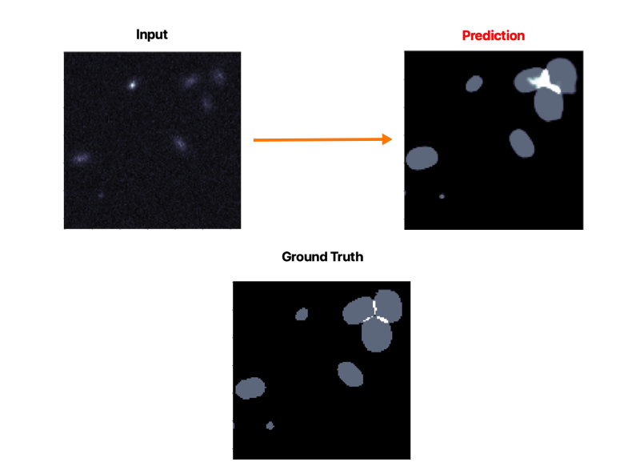
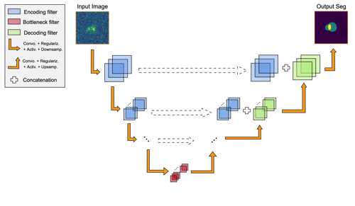
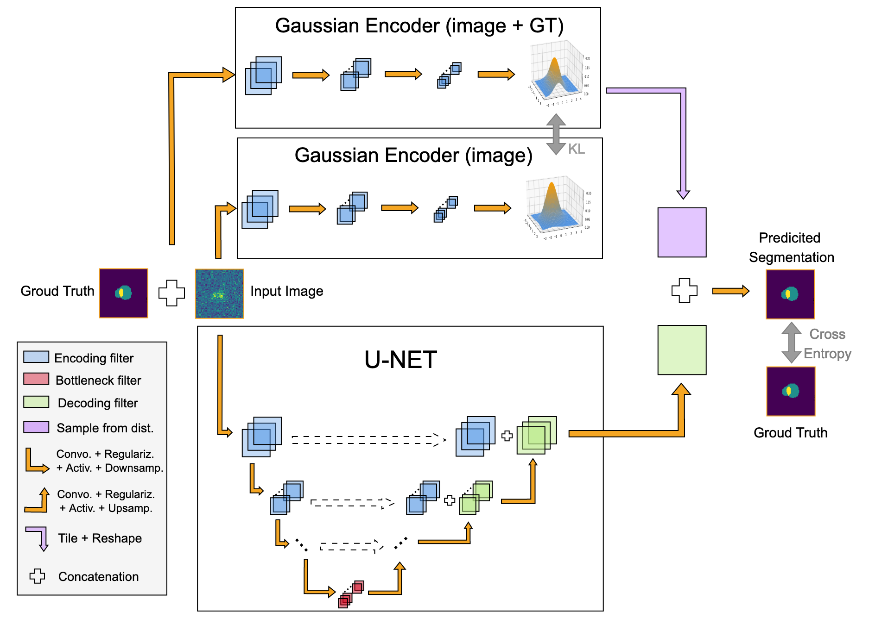
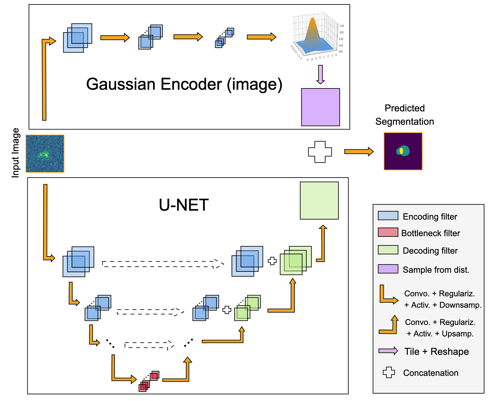
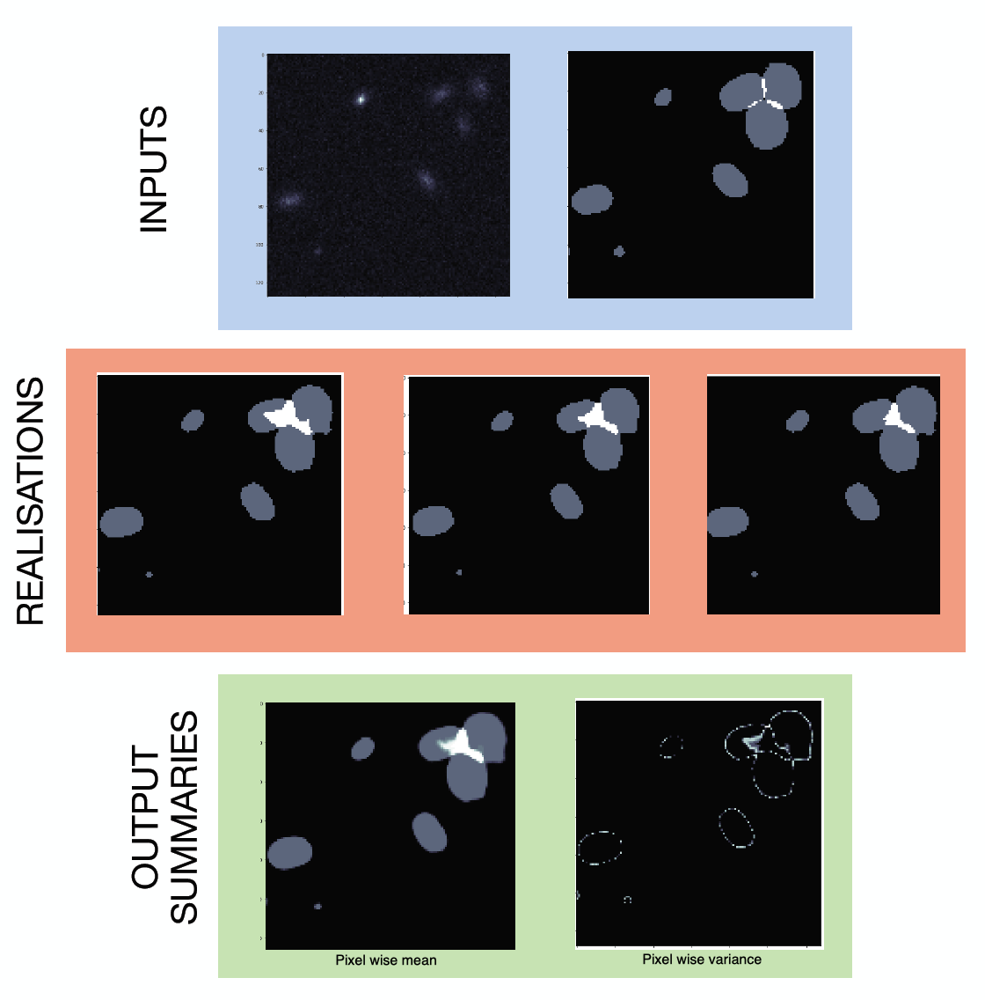
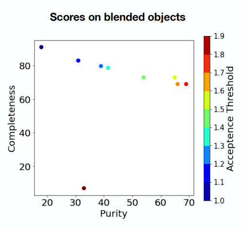

# Blendinator
  

Blendinator is an open source project to produce state of the art segmentation maps of galaxies. It focuses on Euclid like galaxies, and tackle the problem of identifying blending sources (usually falsly call deblending).
It uses probabilistic machine learning to produce the segmentations along with there uncertainty.

## Table of content
- [The core Deep Learning Model  ](#the-core-deep-learning-model---a-name--algo----a-)
  * [Architecture](#architecture)
  * [Training](#training)
  * [Predicting](#predicting)
- [Explaination of the probabilistic part](#explanation-of-the-probabilistic-part)
-[Results](#results)
  * [Metrics](#metrics)
  * [Qualitative Results](#qualitative-results)
  * [Quantitative Results](#quantitative-results)
 
## The core Deep Learning Model  

### Architecture
To produce the segmentation map, we use an anadapted and re-written version of the Probabilistic Unet (Proba-Unet) from [S.Kholl et all](https://github.com/SimonKohl/probabilistic_unet).
The concept of this model is to use two models together, one deterministic and one probabilistic. The deterministic one is a [UNet](https://arxiv.org/abs/1505.04597) architecture, known to produce state of the art segmentation maps, by compressing and decompressing the image thanks to convolutional neural networks. In addition to the classical compression decompression sequence, it concatenates inputs from the previous decompression layers and inputs from the corresponding compression step, in order to give the model informations at every scale. It implies, as you can see in the figure below, the shape of a U, hence the name.

In parallel, we have the probabilistic part of the model, which is made of two similar CNNs. One takes only the input image and output the parameters of a $n$ dimensional Gaussian distribution. The other does the same but with a concatenation of the input image and the corresponding ground truth. The goal of this CNN is to find the distribution of the possible segmentation maps.

 Finaly, a last CNN is used to mix the information of the Unet and the Gaussian Encoders.

### Training
Here is the flow of the training. 

The image passes through the Unet, outputing a cube made of the different class we want to be segmented. Then, the image (and the ground truth) pass through the Image Gaussian Endoder (and the Image+GT Gaussian Encoder). The two corresponding distributions are build, and compared thanks to a Kullback Leibler divergence. This is the first term of the loss. It allows the model to learn the distribution of the segmentation map knowing only the image, by pushing the result of the first CNN to the result of the second.
Then, a sample is drown from the Image+GT encoder, and resized two the shape of the wanted segmentation map. This output is concatenated to the output of the UNet, and pass trough the last CNN. The output of the ProbaUnet is then compare with the ground truth thanks to a cross entropy term.
The total loss is a linear combination of the cross entropy and the KL.

### Predicting
The prediction is made exactly in the same way, but the probabilistic sampling is drawn from the Gaussian Encoders which compress only the image.

## Explanation of the probabilistic part

If the prediction is hard (low magnitude, object very blended, ...), the predicted gaussian will be wide. Hence, sampling from it will lead to very different output.
By sampling many times for each galaxy, we can then stack those results, and compute the pixel wise mean and variance of the different maps. This will be our measure of the uncertainty. As you can see int he following image, the center of the galaxies are very certain, while the borders, where the magnitude dicrease, begin to be more uncertain. In addition, the complex blended region is found but is more uncertain. In addition to a global flag of uncertainty on the object, you can know the uncertainty for every pixel !

  
## Results

We present here results for our special study on Euclid like images.
### Metrics
To test our algorithm, we use different metrics.
The completeness C tells us the fraction of the existing isolated or blended object that we are able to find, regardless of how many false postive we have. the exact formula is :
C = TP/(TP+FN)
where TP and FN are the number of True Positive and False Negative case.

The purity P tells us, inside the positive we found, how many of this positives are true.
P = TP/(TP+FP)
There is of course a trade off between those two metrics.

In blendinator, one can find the equilibrium he wants between the purity and the completeness. Indeed, when we are predicting a filed of view, you can predict the pixel wise mean of many predictions. This will gives each class an uncertainty. For example, instead of havinf a pixel equal 2 (blended pixel), it will be between 1 and 2. Then, one can chose the threshold between 1 and 2 to consider a pixel being blended or not. A high threshold will reduce the number of false detection, but also of true detection. The purity will rase, but the completeness fall. In the opposit, having a low threshold will increase the True Positive, the False Positive, and so increase the Completeness and deacrease the purity. See the following image for an example of this trade off.

### Qualitative results

### Quantitative results

