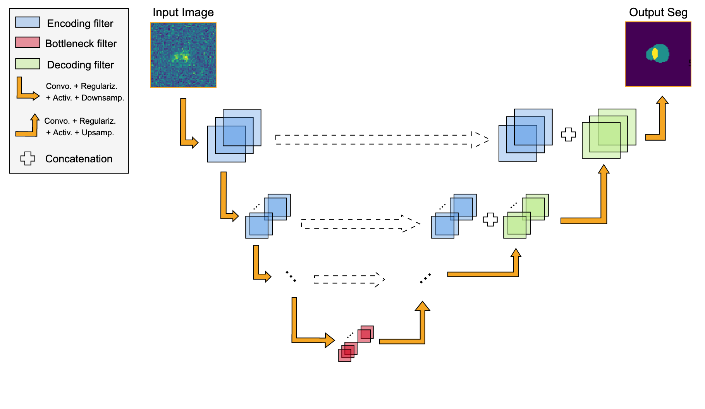
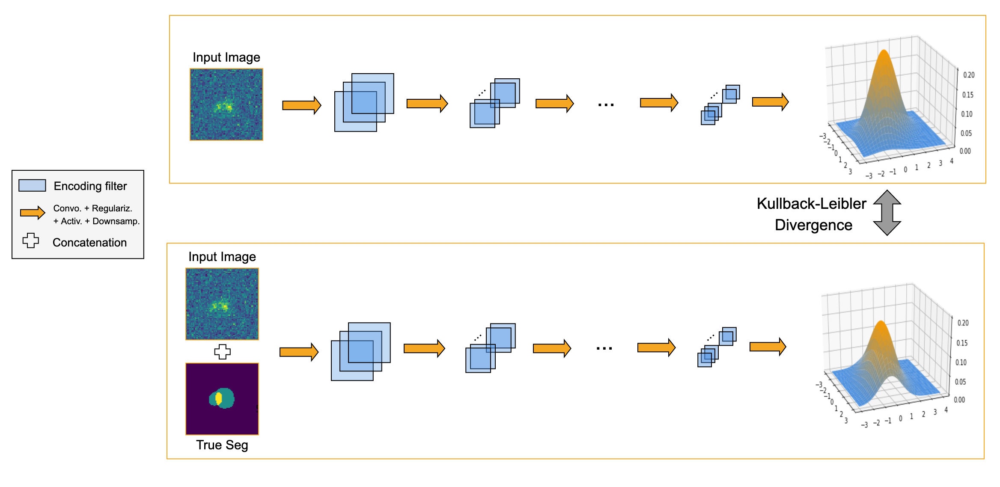
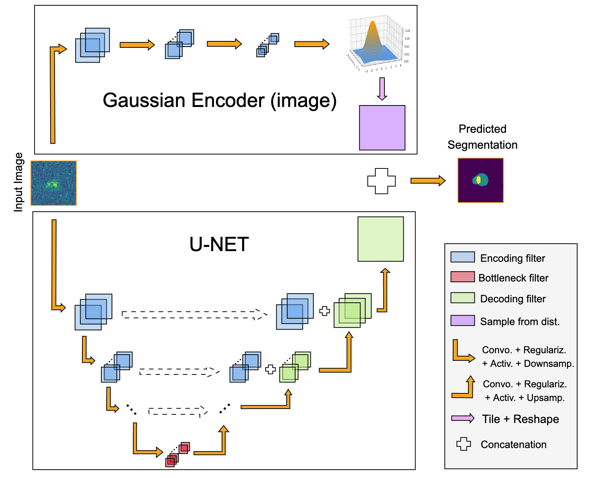

# Blendinator
  
Blendinator is an open source project to produce state of the art segmentation maps of galaxies. It focuses on Euclid like galaxies, and tackle the problem of identifying blending sources (usually falsly call deblending).

It uses probabilistic machine learning to produce the segmentation along with there uncertainty.

## The core Deep Learning Model

### Architecture
To produce the segmentation map, we use the so called ProbaUnet from [S.Kholl et all](https://github.com/SimonKohl/probabilistic_unet), that we  migrated on **Tensorflow 2.0** and adapted for our problem .
The concept of this model is to use to models together, one deterministic and one probabilistic. The deterministic one is a [UNet](https://arxiv.org/abs/1505.04597),  known to produce state of the art segmentation maps, by compressing and decompressing the image thanks to convolutional neural networks. In addition to the classical compression deconpression sequence, it concatenates inputs from the previous layers and inputs from the corresponding compression step, in order to give the model informations at every scale. It implies, as you can see in the figure below, the shape of a U, hence the name.

In parralele, we have the probabilistic part of the model, which is made of two similar CNNs. One takes only the input image and output the parameters of a $n$ dimensional Gaussian distribution. The other does the same but with a concatenation of the input image and the corresponding ground truth. The goal of this CNN is to find the distribution of the possible segmentation maps.
Finaly, a last CNN is used to mix the information of the Unet and the Gaussian Encoders.
### Training
Here is the flow of the training. The image pass through the Unet, outputing a cube made of the different class we want to be segmented. Then, the image (and the ground truth) pass through the Image Gaussian Endoder (and the Image+GT Gaussian Encoder). The two corresponding distributions are build, and compare thanks to a Kullback Liebler divergence. This is the first term of the loss. It allows the model to learn the distribution of the segmentation map knowing only the image, by pushing the result of the first CNN to the result of the second.
Then, a sample is drown from the Image+GT encoder, and resized two the shape of the wanted segmentation map. This output is concatenated to the output of the UNet, and pass trough the last CNN. The output of the ProbaUnet is then compare with the ground truth thanks to a cross entropy term. The final loss is a linear combination of the cross entropy and the KL.

### Predicting
The prediction is made exactly in the same way, but the probabilistic sampling is drawn from the Gaussian Encoders which compress only the image.

